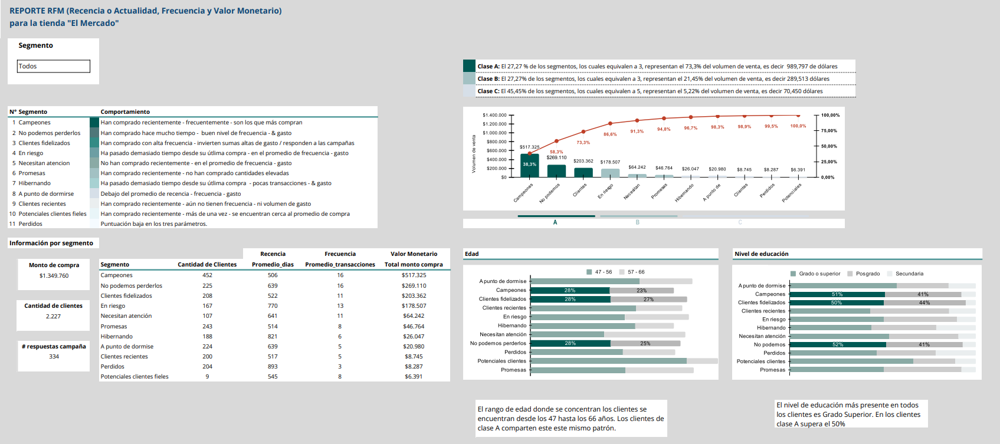
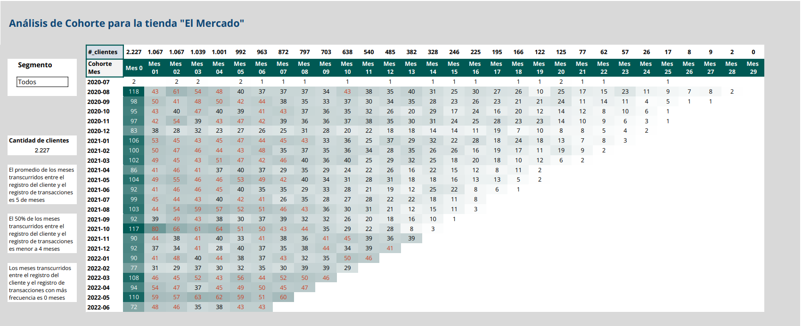

# Proyecto de Segmetacion con RFM

En este proyeccto se analiza las ventas a fin de segmentar la base de clientes mediante la metodología RFM (Cuán reciente, Frecuencia y Valor Monetario) de la tienda "El Mercado". Esta estrategia proporcionará a la empresa una ventaja competitiva clave al brindar un profundo entendimiento del comportamiento de compra de sus clientes y permitirá la toma de decisiones estratégicas basadas en datos.

EL objetivo como Analista de Datos es preparar la base de datos para aplicar la segmentación de clientes a través de RFM y sacar conclusiones que posibiliten a la empresa a tomar decisiones, además de buscar información importante que se encuentra oculta en los datos, como por ejemplo: ¿Quiénes son estos clientes? ¿Están casados? ¿Tienen hijos? ¿Cuántos años tienen? ¿Cuál es el volumen de ventas de la empresa (en cantidad)?

Es posible analizar los datos con más profundidad aún mediante lo que se conoce como análisis de cohorte. Este análisis permitire entender el comportamiento de los clientes que comenzaron a comprar en un mismo mes y, por lo tanto, calcular una nueva métrica llamada porcentaje de retención de clientes mes a mes.

